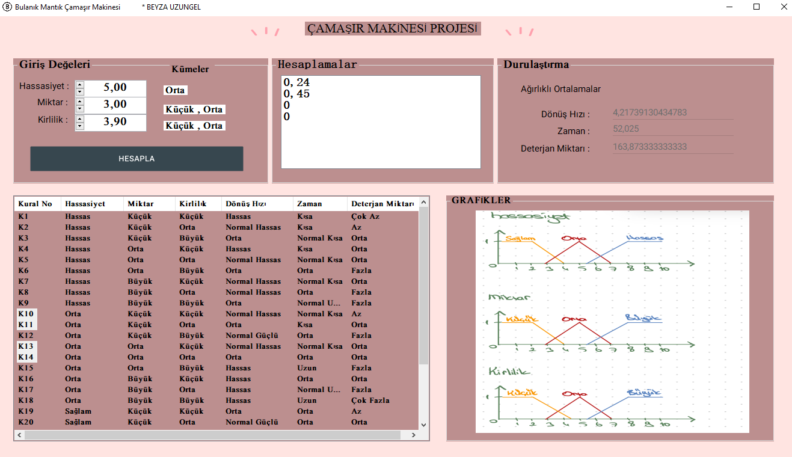

# Bulanık Mantık Çamaşır Makinesi Kontrol Sistemi

Bu proje, bir çamaşır makinesi için bulanık mantık denetleme sisteminin modellenmesi ve kodlanması üzerine yapılmıştır. Proje, Windows Form App kullanılarak geliştirilmiş olup, tüm aşamaları C# programlama dili kullanılarak gerçekleştirilmiştir.

## Proje Amaçları

- Çamaşır makinesinin hassaslık, kirlilik ve miktar gibi giriş değerleri form üzerinden girilip değiştirilebilir.
- Giriş değerleri verildiğinde, program tetiklenen kuralları belirlemeli ve bulanıklaştırılmış giriş değerleri ile her bir kural için Mamdani değerlerini göstermelidir.
- Program, sonuç olarak deterjan miktarı, süre ve dönüş hızını Mamdani çıkarım mekanizması ve ağırlıklı ortalama durulaştırma yöntemine göre hesaplayarak vermelidir.

## Özellikler

- **Giriş Değerleri:** Hassaslık, kirlilik ve miktar gibi giriş değerleri form üzerinden girilip değiştirilebilir.
- **Kurallar ve Mamdani Değerleri:** Program, tetiklenen kuralları belirleyerek bulanıklaştırılmış giriş değerleri ile her bir kural için Mamdani değerlerini gösterir.
- **Sonuçlar:** Deterjan miktarı, süre ve dönüş hızı Mamdani çıkarım mekanizması ve ağırlıklı ortalama durulaştırma yöntemine göre hesaplanarak kullanıcıya sunulur.

## Nesne Yönelimli Programlama

Proje, nesne yönelimli programlama ilkelerine bağlı kalarak kodlanmıştır. Bu sayede kodun daha okunabilir, yönetilebilir ve genişletilebilir olması hedeflenmiştir.

## Nasıl Kullanılır?

1. Proje dosyalarını bilgisayarınıza indirin.
2. Visual Studio veya benzer bir geliştirme ortamında projeyi açın.
3. Windows Form uygulamasını çalıştırarak programı başlatın.
4. Form üzerinden çamaşır makinesinin hassaslık, kirlilik ve miktar gibi giriş değerlerini girin veya değiştirin.
5. Giriş değerlerini verdikten sonra program, Mamdani çıkarım mekanizması ve ağırlıklı ortalama durulaştırma yöntemine göre sonuçları hesaplayarak kullanıcıya sunar.

